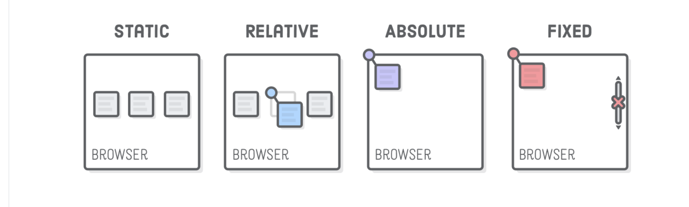

# Week 3 HTML CSS JQUERY

# basics

doctype
head
tags
elements
links
scripts
ID: unique used to call in CSS with #
Class: used to call in CSS with dot notation. Does not have to be unique

# JQUERY

body = document.querySelector('')

div = document.createElement('')

append.child('')

# Forms

labels using for = '' and attached to an input name = '' will link the two.

# CSS

link your stylesheet in the <head> with <link rel='' href=''>

use dotNotation for calling classes with class=''
use # for calling elements by id=''

# flex

Positioning

    use Divs to controll Div elements

    static - default. not affected by 'left' etc

    relative - positions outside of static. uses 'left' 'right' etc. Will space from content

    absolute - will fixed itself to the non static element. If none will attach to the body and will cover other images in the way

    fixed - similar to absolute but stays fixed to the browser window despite where you are on the code. Best for nav bars sidebars heading menus and footers

    sticky - vuewable when scrolling. Will fix to a spoistiob when user scrolls out of its position.

# Media Query
    a condition that happens when something is triggered. Usually the size of the screen.

@media
screen
and
(max/min width)
called like a function
@media screen () {

}

example:
@media screen [and] (max-width: 500px) {
    .element {
        css props
    }
}

# Grid

set the div to display: grid in css.
define the columns and rows with grid-template-columns and grid-template-rows

                        ______________________
                        |fr fr fr fr fr fr fr fr
                        |fr
                        |fr
                        |fr
                        |fr
                        |fr
                        |fr

this is 8 x 7. Using fraction to take up the entire screen evenly. 

ex:
    display: grid;
    grid-template-columns: 1fr auto 1fr .5fr;
    grid-template-rows: 1fr auto 1fr .5fr;
    height: 100vh;
    grid-template-area:
    'main main main main'
    'sidebar main main main'
    'sidebar main main main'
    'footer footer footer footer'

this gives the grid area its layout. It still need to be called within its CSS rules

ex:

main {
    grid-area:main
}

.sidebar {
    grid-area:sidebar
}

#footer {
    grid-area: footer
}

use 'gap' to gap between spaces.